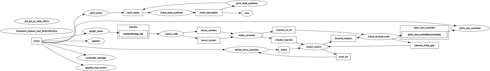

# EXPERIMENTAL ROBOTICS LABORATORY #
# Assignment 1 - Emanuele Giordano - S4479444@studenti.unige.it #

## Description
The assignment consisted in the control of a mobile robot with ROS2, which is embedded in a 3D environment simulator called Gazebo.
The goal is to make the robot move around, and reach four markers in a specified order; in particular, each marker has a corresponding action to-be-performed by the robot, namely:

1 - marker 11: rotate until find marker 12, then reach it.

2 - marker 12: rotate until find marker 13, then reach it.

3 - marker 13: rotate until find marker 15, then reach it.

4 - marker 15: objective completed.

## Robot Model
The mobile robot is modeled with the classic layout of a differential drive robot: the chassis, the main element of the robot structure, connects the two wheels with continous joints (which grand them smooth motion).
In particular, the *link_chassis* provides the principal structural component of the robot, while *link_right_wheel* and *link_left_wheel* (attached with *joint_right_wheel* and *joint_left_wheel* respectively), provide motion to the robot.
On the other hand, the camera system is split into two parts, namely *link_camera_rot* and *camera_link*: the latter is mounted on the former, which grants dynamic orientation adjustments.
This system provides for better performances on perception and environment interactions.

## Program Logic
The logic of the program can be explained in terms of the main nodes:

1 - *RobotController*: it enables the *RobotRevJ* node to start the camera rotation, in order to make the robot scanning the environment, in search of the Aruco Markers. The camera is designed to stop rotating, only when the scanned area stops growing, meaning the it has aligned with the target.

2 - *MotorControl*: once the camera is pointing to the target, it sends the rotation angle value to the robot, which in turn aligns itself too; based on the error between the actual and desired angle, the *MotorControl* node publishes the rotation speed to *RobotRevJ* node, so that it can rotate in the opposite direction and maintain the alignment with the camera.

3 - *RobotRevJ*: revolute joint of the link between the camera and the chassis. It subscribes to the motor controller, which provides the rotation speed during the alignment phase.

Once the robot is aligned with the camera, the robot starts moving forward.
Moreover, while the robot moves, the *RobotController* node checks for the length of the longest visible side from the camera; when this value goes above a given threshold, then the target is reached, and the process is repeated for the next marker.
Once all markers are reached, the program halts.

The three main nodes are therefore connected to each other, giving rise to the program logic shown in the flowchart below:
 
<figure>

</figure>
 

whereas the full ROS2 node graph is depicted below:
 
<figure>

</figure>
 

# ---------------------------------------------------------------------------- ROS2 Nodes ----------------------------------------------------------------------------- #

## RobotController
The *RobotController* node has the purpose of controlling the robot's motion, according to the detection data of AruUco markers from the camera.
A timer periodically executes the main controller logic, handling the robot's behavour through the use of a flag.

Subscribers:
    1 - `aruco_markers`: it listens for the ArUco markers information detected by the camera, and then updates the internal state with marker IDs.
    2 - `aruco_corners`: it listens for updates of detected ArUco markers' corners, providing the internal state with the corners' coordinates.

Publishers:
    1 - `camera_on_off`: publishes a bool message to activate/deactivate the camera rotation;
    2 - `marker_reached`: publishes a bool message, with values:
            - true: the robot has reached the selected marker;
            - false: the marker has been lost by the camera.

Internal Variables:
    - `id_marker`: ID of current marker to be reached;
    - `position_marker`: index of the current marker, from the list of detected markers;
    - `corners_marker`: corners of the currently targeted marker;
    - `goal_markers`: list of goal ArUco markers;
    - `reached_markers`: number of successfully reached markers;
    - `flag`:   internal flag employed by the controller logic, to switch between different operating modes, namely *camera rotation* and *marker following*;
    - `flag_marker`: checks if the the targeted marker has been detected by the camera;
    - `last_marker_area`: memory value for comparing two consecutive measurements of the room area;
    - `iteration`: wait for the inaccurate measurement of the camera.

Logic:
    1 - `flag == 0`: Camera Rotation Mode
        Enables camera rotation and waits for a detection of a targeted ArUco marker; when such is found, goes to Marker Following Mode;
    2 - `flag == 1`: Marker Following Mode
        Follows the targeted marker through a feedback loop with the camera; it checks whether the marker is within a certain area, in order to consider it as reached;
    3 - `flag == 2`: Task Successful
        Terminates the node when all makers have been reached.

## MotorControl
Its job is to control the robot motion, by waiting for the angle of the marker detected by *RobotController* node, and then aligning the robot with such angle. In this way, the robot can move directly towards the targeted marker, until it receives a stopping command from the *RobotController*.

Subscribers:
    1 - `odom`: handling the robot odometry, used to align the robot orientation with the angle of the marker detected by the camera;
    2 - `camera_theta_goal`: receives the angle of detected marker, and begins aligning itself to this orientation;
    3 - `marker_reached`: receives a bool msg from the controller, indicating if the detected marker's area in the camera FOV is great enough to consider the marker as reached.

Publishers:
    1 - `cmd_vel`: publishes a Twist msg to move the robot;
    2 - `inverse_rotation`: used to synchronize the rotation of the robot with that of the camera, such that the camera can keep the target in its FOV while moving.

Internal Variables:
    - `theta`: orientation angle of the robot;
    - `theta_goal`: orientation angle of the marker, detected by the camera;
    - `flag`: internal flag used to handle the node state;
    - `dt`: timer and sleep period inside the node.
    - `reached_markers`: number of successfully reached markers.

Logic: 
It periodically executes a timer to handle the main controller logic, switching between the following states:
    - `flag == 0`: waits for the detection of the marker by the camera, and increments its value by 1 as soon as the angle of the marker is acquired.
    - `flag == 1`: aligns the robot with the detected marker, constantly publishing its actual rotation speed to the camera, in order to keep the target in its FOV while moving.
    - `flag == 2`: moves directly towards the marker, until receiving a halt command from the controller;
    - `flag == 3`: the robot stops and moves backwards, to allow for the next iteration.

## Robot Revolute Joint Node
It handles the camera joint, attached to a vertical link that is able to rotate on the z-axis.

Subscribers:
    1 - `camera_on_off`: listens to the robot_action_client, which sends a bool with the values:
        - true: the joint rotates with constant angular velocity, to scan the robot's surroudings in search for a new target;
        - false: the joint compensates for the robot's rotation;
    2 - `inverse_rotation`: listens to the motor_controller, in order to know which direction the robot's chassis is rotating, and compensates the camera orientation in order to keep it aligned with the targeted marker;
    3 - `marker_reached`: listens to the robot_action_client, to know whether a marker has been reached or not.

Publishers:
    1 - `camera_theta_goal`: sends the current rotation angle to the wheeled robot, in order to let it know the required orientation to reach the next marker;
    2 - `/joint_cam_controller/commands`: updates the joint position along the z-axis, of a certain angle over a fixed period of time.

Internal Variables:
    - `current_angle`: current angle of the camera;
    - `sign`: direction of rotation, 1 (clockwise) or -1 (counterclockwise);
    - `op_mode`: operating mode of the camera, true (scanning) or false (compensating);
    - `dt`: control loop sampling period;
    - `angular_vel`: current angular velocity of the robot's chassis;
    - `mode_timer`: timer for handling the operating modes;
    - `theta_goal`:  current angle of the marker detected by the camera, and sent to the wheeled robot in order to start the tracking;

Logic:
It periodically executes a timer function, which handles the operating mode of the camera:
    - `op_mode == true`: the camera incrementally rotates, and commands are published to rotate the joint;
    - `op_mode == false`: the camera compensates its orientation based on the angular velocity of the robot's chassis, and publishes the goal angle.

# ---------------------------------------------------------------------- Installation and running --------------------------------------------------------------------- #
1) Download the repository inside your workspace with:

# git clone https://github.com/S4479444/ExpRo/Assignment1 #

2) From the root directory of ROS2 workspace, run: `colcon build`

3) Install Konsole with: `sudo apt-get install konsole`

4) Run the following command inside `/src/Assignment1` of your root directory:
        chmod u+x launch_exp.sh

5) Run the code with: `bash launch_exp.sh`

# --------------------------------------------------------------------------------- Videos ---------------------------------------------------------------------------- #
